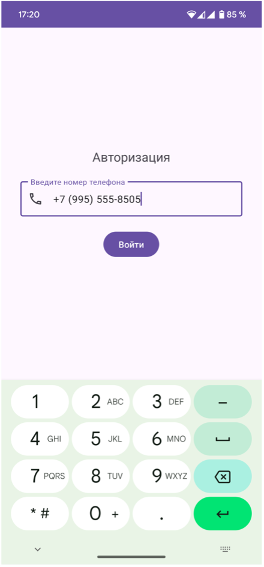
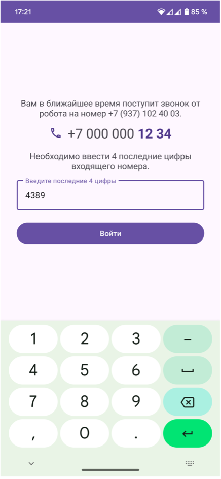
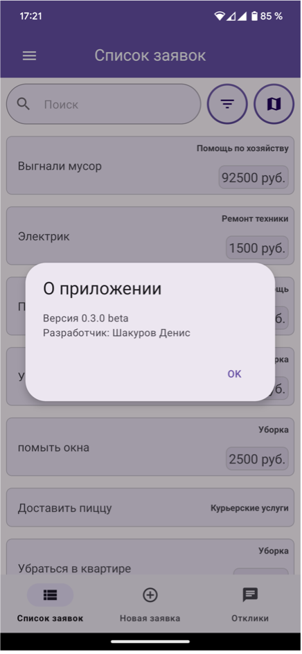
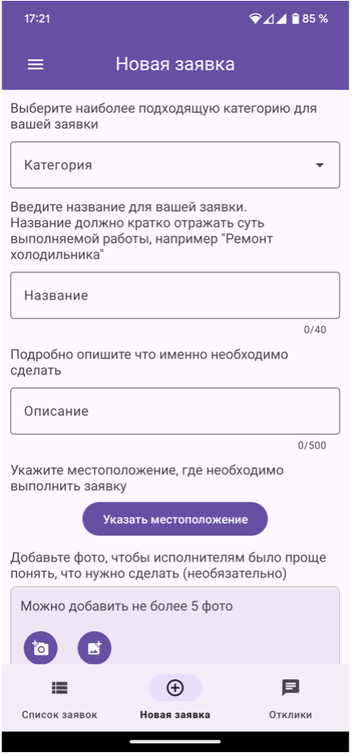
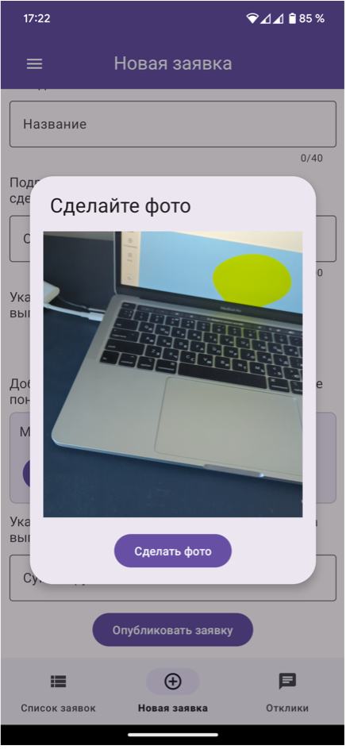
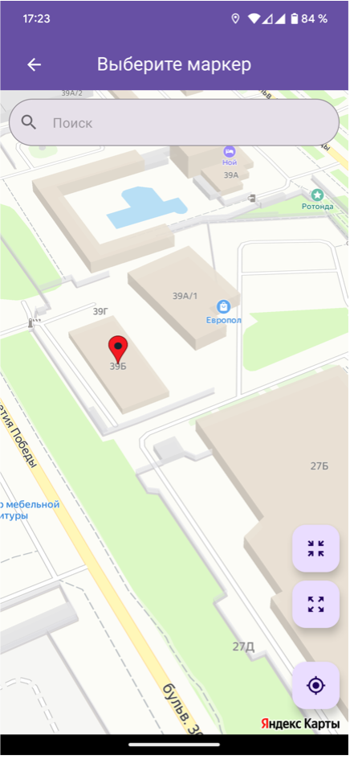

# Мобильное приложение "Цена вопроса"

## Описание проекта

Приложение "Цена вопроса" представляет собой мобильное приложение, предназначенное для организации взаимодействия между потребителями услуг и исполнителями. Пользователи могут создавать заявки на выполнение определенных задач, а исполнители могут откликаться на эти заявки, предлагая свои услуги.

## Функциональность приложения

- **Регистрация пользователей:** Пользователи могут зарегистрироваться как исполнители или потребители услуг.
- **Создание заявок:** Потребители могут создавать заявки на выполнение различных задач, описывая их подробно, добавляя фотографии и указывая цену.
- **Отклик на заявки:** Исполнители могут откликаться на заявки, предлагая свои услуги и указывая цену за выполнение работы.
- **Просмотр и выбор заявок:** Потребители могут просматривать отклики от исполнителей, выбирать наиболее подходящие и принимать их.
- **Обмен контактной информацией:** В случае принятия отклика, контактная информация передается исполнителю для последующей связи.

## Технологии

- **Язык программирования:** Java
- **База данных:** Yandex Managed Service for YDB
- **Аутентификация:** сервис sms.ru
- **Хранение файлов:** Yandex Object Storage
- **Картография:** Yandex MapKit

## Скриншоты

Ниже представлены скриншоты приложения "Цена вопроса":

<table>
  <tr>
    <td></td>
    <td></td>
    <td></td>
  </tr>
  <tr>
    <td></td>
    <td></td>
    <td></td>
  </tr>
</table>

## Инструкция по сборке проекта

1. **Клонируйте репозиторий:**
   ```
   git clone https://github.com/Den-88/PriceQuestion
2. **Откройте проект в Android Studio:**
   - В главном меню выберите **"Open an existing project"** и укажите путь к проекту.

3. **Синхронизируйте Gradle:**
   - Когда появится уведомление, нажмите **"Sync Now"** для загрузки всех зависимостей.

4. **Соберите и запустите проект:**
   - Выберите режим сборки (`Debug` или `Release`).
   - Нажмите **"Run"**, чтобы начать выполнение на устройстве или эмуляторе.

## Разработчик
- **Шакуров Денис Дамирович**
